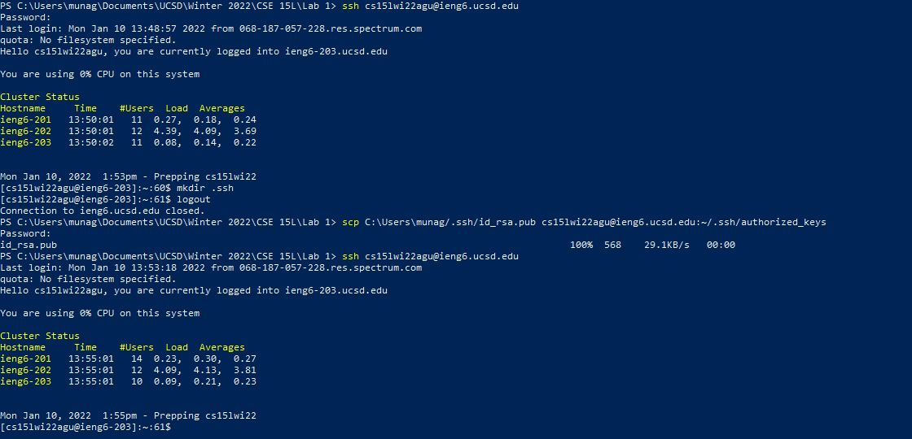
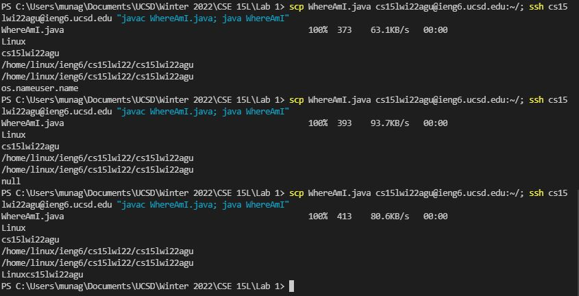

# **CSE 15L Lab Report 1**

## Rishi Munagala

## Week 2:

**Installing VScode:**

The first step was to install the ide Visual Studio Code. I had to basically go to [https://code.visualstudio.com/](https://code.visualstudio.com/) and follow the instructions to install and make sure that when I open it, it looks like the screenshot below.

**Remotely Connecting:**

The next step was to remotely connect to the server. I would open the terminal on VsCode and use the command `ssh` meaning secure shell and then my course-specific account which was “cs15lwi22agu@ieng6.ucsd.edu.” So I would type: 
`ssh cs15lwi22agu@ieng6.ucsd.edu` into the terminal and enter the password once it prompts me.

**Trying Some Commands:**

Next was to try out some commands once on the server. Two of the commands are shown in the screenshot below. `ls -a` lists all the files and hidden directories within the current directory. `ls-lat` lists all the files in the current directory but shows more detailed info regarding who has access, size, and date modified of each file. Another set of commands to try is `cd` which changes the current directory of the command line to whatever follows.

**Moving Files with SCP:**

For the next part, we used SCP also known as a secure copy to copy files from the local client to the remote server. As shown in the screenshot below, I had to first create a file named “WhereAmI.java” on my local machine. Then I had to make sure I was logged out of the server by entering CTRL+D and using the command `scp WhereAmI.java cs15lwi22agu@ieng6.ucsd.edu:~/` in order to transfer the file and it shows 100% meaning the copy was successful.

**Setting an SSH Key:**

For setting an ssh key, the first step was to type the command `ssh-keygen` on the computer and follow the steps like the image below. 

One key step to solving an issue I had was opening PowerShell as admin to do these steps and to start the `ssh-agent` by typing the first three commands as shown in the first screenshot below. Then I use the command ssh-add and the location of where the save key was stored.

Then logging back into the server, I type the command `mkdir .ssh` to create the .ssh folder and log out. Next on the client type the command: `scp C:\Users\munag/.ssh/id_rsa.pub cs15lwiagu@ieng6.ucsd.edu:~/.ssh/authorized_keys` (replace the username and path pertaining to your own account and where you stored the keys).
Once finished, I was able to log in to the remote server without entering a password saving some time.

**Optimizing Remote Running:**

The last step was to make remote running more pleasant. One was to use the usual ssh command followed by your course-specific account, but adding commands such as `scp` or `javac` and `java` commands can run those commands on the servers and then log out immediately back to your client. This makes it so you can do the steps of logging in to the server, typing the command, and then logging out all in one command.

In the screenshot below, using `javac` and `java` we can see the file `WhereAmI.java` running on the client.

If we then add an edit to the code like in the last line of code on the file on the client, we can copy and run these changes on the server. In the last command of the second screenshot below, using the command `scp WhereAmI.java cs15lwi22agu@ieng6.ucsd.edu:~/; ssh cs15lwi22agu@ieng6.ucsdlwi22agu@ieng6.ucsd.edu "javac WhereAmI.java; java WhereAmI"` allows us to first copy the file, then login to the remote server, run the `javac` and `java` commnands, and immediately logout.

This helps save time and keystrokes since the screenshot above shows that editing a file and copying it can be a process of trial and error. The screenshot shows the command running three times where the last attempt works how we wanted it to. Typing the command itself is 138 keystrokes. Not only does this save time and keystrokes in copying and running on the server temporarily, but by using the up arrow, it allows the user to call the previous command without retyping it.

