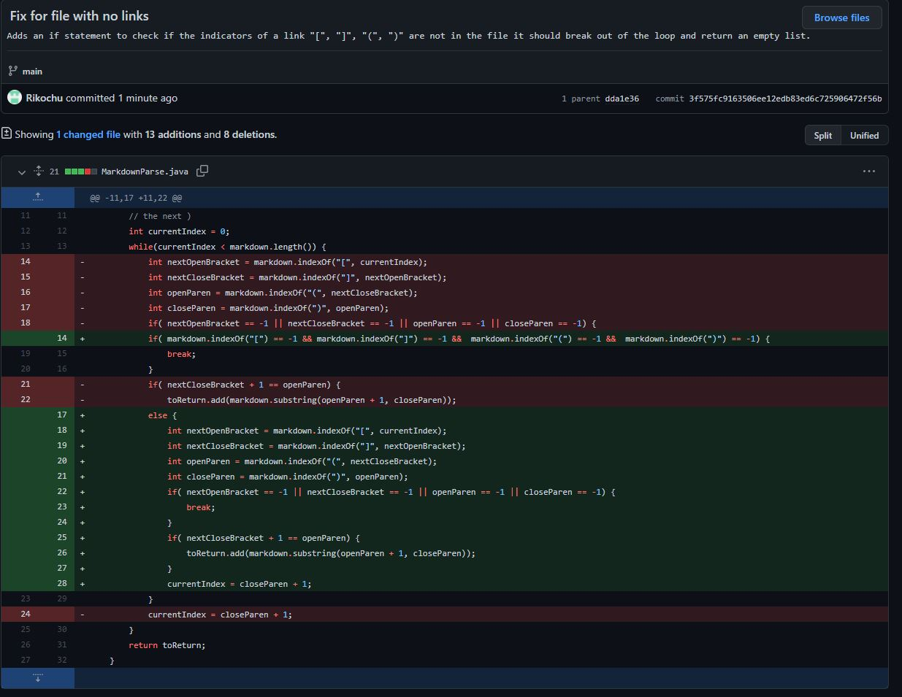

# **CSE 15L Lab Report 2**

## Rishi Munagala

## Week 4:

**File with Words Between:**

  [*Failure-Inducing Input*](https://github.com/Rikochu/markdown-parse/blob/main/fileWithSpace.md?plain=1) of words in between.
  
  *Symptom:*
  
  

  Code Change:
  
  

***

**File with Words After:**
  
  [*Failure-Inducing Input*](https://github.com/Rikochu/markdown-parse/blob/main/loop.md?plain=1) of words after last link.
  
  *Symptom:*
  
  

  Code Change:
  
  
  
 ***
  
**File with no Links:**

  [*Failure-Inducing Input*](https://github.com/Rikochu/markdown-parse/blob/main/noText.md?plain=1) of no links.
  
  *Symptom:*
  
  

  Code Change:
  
  
