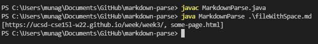

# **CSE 15L Lab Report 2**

## Rishi Munagala

## Week 4:

**File with Words Between:**

  [*Failure-Inducing Input*](https://github.com/Rikochu/markdown-parse/blob/main/fileWithSpace.md?plain=1) of words in between.
  
  *Symptom:*
  
  

  Code Change:
  
  
  
  Here the *failure-inducing input* was the file where there was words between the closed bracket and the next open parenthesis, it should not be considered a link, but the program would consider it a link. The *symptom* in this case is the arraylist of two link when it should only show one list. To fix the bug in the code, an `if` statement to check if the open parenthesis is one index to the right of the closed bracket makes sure to only add the link if that relation is true.

***

**File with Words After:**
  
  [*Failure-Inducing Input*](https://github.com/Rikochu/markdown-parse/blob/main/loop.md?plain=1) of words after last link.
  
  *Symptom:*
  
  

  Code Change:
  
  
  
  Here the *failure-inducing input* was the file where there was words after the last link and it would cause the program to break since if the file doesn't end in a link, it starts over from the beginning. The *symptom* in this case is the error `java.lang.OutOfMemoryError` that is due to the infinite loop. To fix the bug in the code, an `if` statement at the end to check if the local variables in the method are equal to -1 due to not finding the index and it will break out of the `while` loop.
  
 ***
  
**File with no Links:**

  [*Failure-Inducing Input*](https://github.com/Rikochu/markdown-parse/blob/main/noText.md?plain=1) of no links.
  
  *Symptom:*
  
  

  Code Change:
  
  
  
  Here the *failure-inducing input* was the file with no links and just text. The *symptom* in this case is the error `java.lang.StringIndexOutOfBoundsException` from the output that is due to the -1 returned from `indexOf()` not finding links. Using the same fix for the file with words after the link will fix the bug in the code. It will make sure to break if the local variables in the method are equal to -1. In this case, fixing this one bug in the code allowed the program to work with two different inputs that would result in different *symptoms.*

