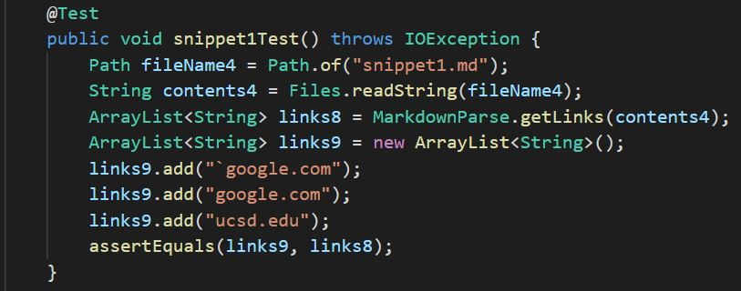
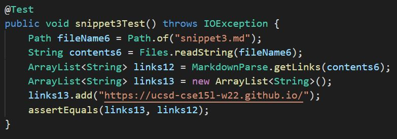

# **CSE 15L Lab Report 4**

## Rishi Munagala

## Week 8:

Used CommonMark demo site to see what should be produced: 
  
  **Snippet 1)**
  
  
  **Snippet 2)**
  
  
  **Snippet 3)**
  

***

  Code of Tests in MarkdownParse.java:
  
  **Snippet 1)**
  
  
  
  **Snippet 2)**
  
  
  
  **Snippet 3)**
  
  
  
***

**[My MarkdownParse](https://github.com/Rikochu/markdown-parse)**
   
  Output of my MarkdownParse:
  
   
  **Snippet 1)**
  
  I think it would need to be a small change fix. Checking if the character at the index before the open bracket is a backtick can avoid including the false links. Also to fix the issue where the bracket inside the bracket causes the link not to be included can be fixed by checking if the next closed bracket is before the next open bracket or if there is no next open bracket. This would then allow the code to use the second open bracket rather than the one that should be considered part of the text. 
  
  **Snippet 2)**
  
  This fix could  be a bit longer of a fix than 10 lines. The issue from the output is if the first open bracket is at index 0, then `charAt(0-1)` would result in a negative index throwing the exception. So to fix this, is to add another check in the `if` statement to make sure `nextOpenBracket` is not equal to 0. To check if there is a link inside of brackets, would be to check if there is an another open bracket before the next closed bracket and then using recursion to recall the function from that bracket to see if there is a link can include the embedded link like the first example.
  
  **Snippet 3)**
  
  This should be a small change as well. The first issue is the exception that is resolved with solution for snippet 2. To make sure that the links that have line breaks are not counted would be to use an `if` statement to check that there is not two `\n` next to each other. This way, like the snippet 3 expected output from commonmark shows, the links that only have one `\n` can avoid the line break links.

 ***

 **[Reviewed MarkdownParse](https://github.com/kathyychenn/markdown-parse)**
   
  Output of Reviewed MarkdownParse:
  )
  
   **Snippet 1)**
  
  I think it would need to be a small change fix. To first fix the issue with the exception from the output, rather than checking if `nextOpenBracket != 0`, it would be better to check if `nextOpenBracket <= 0` so it disregard the case where `nextOpenBracket` is -1 which would make -1-1 = -2, thus throwing the exception for `charAt()`. Similar to my markdownParse, the next issue of backticks can be fixed by checking if the character at the index before the open bracket is a backtick. Also to fix the issue where the bracket inside the bracket causes the link not to be included can be fixed by checking if the next closed bracket is before the next open bracket or if there is no next open bracket. This would then allow the code to use the second open bracket rather than the one that should be considered part of the text. 
  
  **Snippet 2)**
  
  There could need be a bit longer of a fix. The first issue with the output can be fixed with the solution from snippet 1. Like my markdownParse, to check if there is a link inside of brackets, would be to check if there is an another open bracket before the next closed bracket. Then we can use a recursive call to function from that bracket to see if there is a link can include the embedded link like the first example.
  
  **Snippet 3)**
  
  This should be a small change as well. The first issue with the output can be fixed with the solution from snippet 1. Similar to the fix for my markdownParse, to make sure that the links that have line breaks are not counted would be to use an `if` statement to check that there is not two `\n` next to each other. This way, like the snippet 3 expected output from commonmark shows, the links that only have one `\n` can avoid the line break links.
