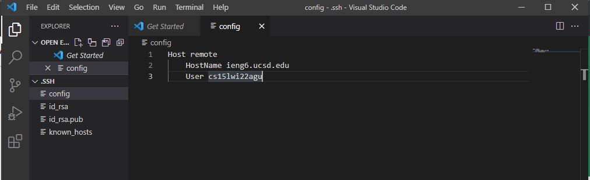
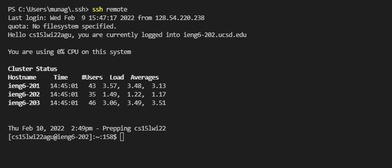
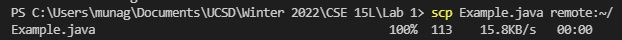

# **CSE 15L Lab Report 3**

## Rishi Munagala

## Week 8:

**[My MarkdownParse](https://github.com/Rikochu/markdown-parse)**

   The first step is to open the `.ssh` folder in an editor like Visual Studio Code. If there is no file named `config` then create a new one.
   Add the text as shown by the screenshot below. The `remote` in this case is the name you would `ssh` with. Make sure to also use your specified username for User.
   
  

 ***

 **[Reviewed MarkdownParse](https://github.com/kathyychenn/markdown-parse)**
   
   Then by typing `ssh` and the chosen alias which in the case of the screenshot below is `remote`. You can login to the server typing less.
   
  

 ***
 
 **Using `scp` Command with Alias:**

   By using this alias, it also makes it easier to do command such as `scp` files without needing to type the whole account name. 
   In the picture below, you can copy a file such as `Example.java` by using the command `scp Example.java remote:~/` saving time and keystrokes.
   
  

 ***
