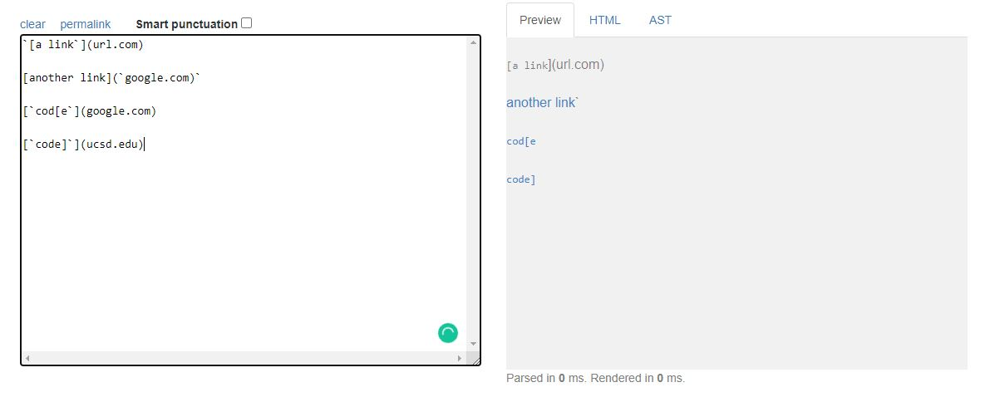
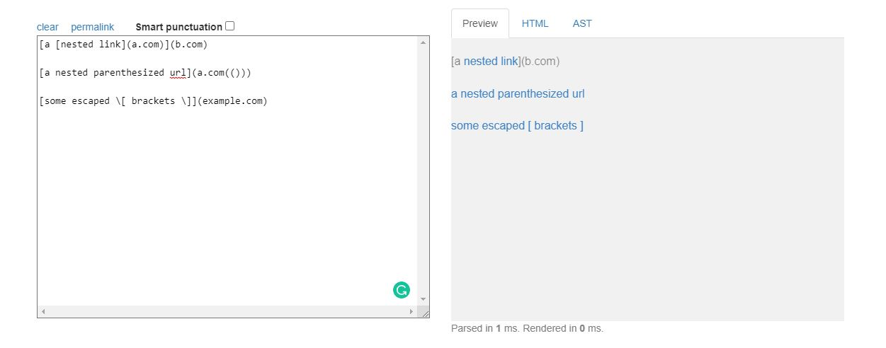
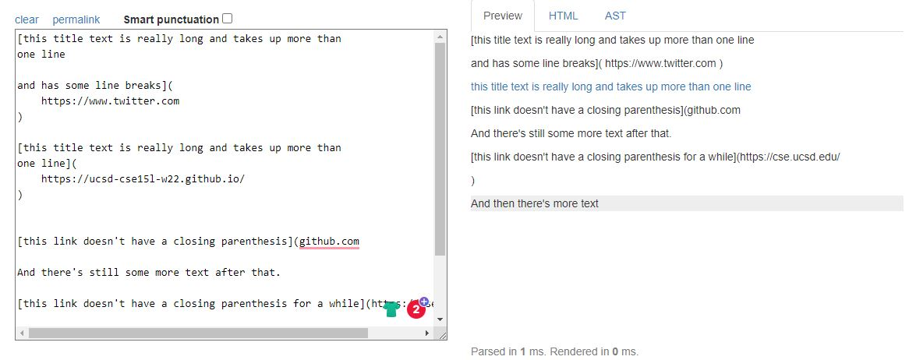
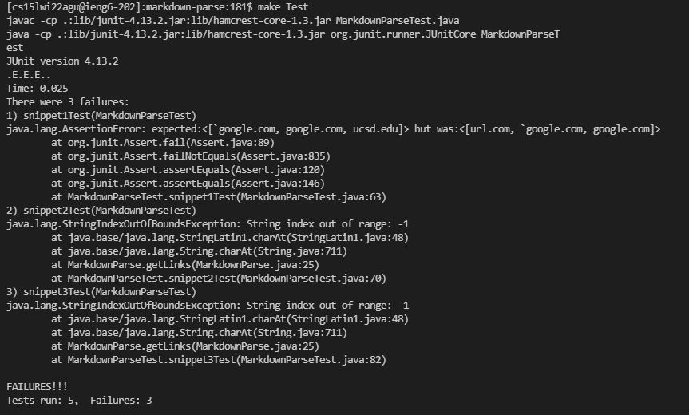
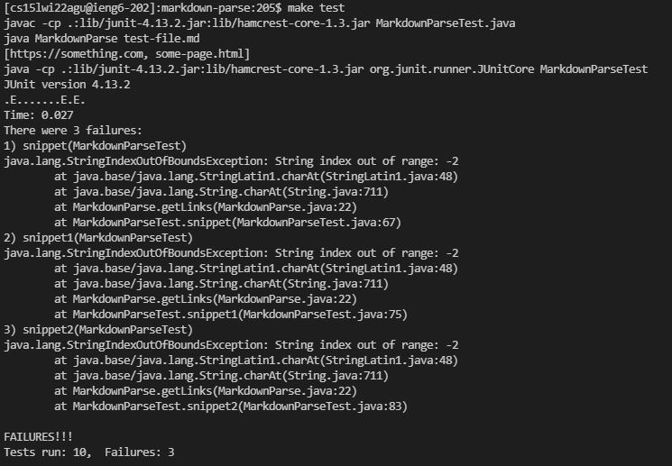

# **CSE 15L Lab Report 3**

## Rishi Munagala

## Week 8:

Used CommonMark demo site to see what should be produced: 
  
  **Snippet 1)**
  
  
  **Snippet 2)**
  
  
  **Snippet 3)**
  
 
***

**[My MarkdownParse](https://github.com/Rikochu/markdown-parse)**
   
  Output of my MarkdownParse:
  
   
  **Snippet 1)**
  
  
  **Snippet 2)**
  
  
  **Snippet 3)**
  

 ***

 **[Reviewed MarkdownParse](https://github.com/kathyychenn/markdown-parse)**
   
  Output of Reviewed MarkdownParse:
  )

