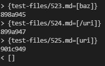

# **CSE 15L Lab Report 5**

## Rishi Munagala

## Week 10:

**How to find different results:** 
  
In order to find the different results between my markdownparse and the provided implementation, using the command `diff` on the `.txt` files that had the outputs of all files listed would work. To create the file with the list of outputs, creating a bash file that runs a for loop on each file and prints the output is needed. Then using the command `bash (name of script file).sh > (name of txt file).txt` allows the output of each file to be saved on each line of the file.

***

**Test 530.md:**
  
  `[][ref]`
  
  **Output:**
 
  
  
  For this case, I think that my implementation is correct. The difference here by the image above is that my implementation returns an empty list while the given implementation returns a list including `moon.jpg` which is an image link. An image link is different than a link that `MardownParse.java` should return so this input should return an empty list.
  
  To fix this, would be be have an `if` statement that checks for image links specifically. The image below shows the code from my implementation where it considers if an `!` is before the open bracket and continues without return that link. The given implementation should use a similar check.
  
  
 
***
 
 **Test 519.md:**
  
  `](uri2)](uri3)`
  
  **Output:**
 
  
  
  In this case, I think that the given implementation is correct. This can be confirmed by the commonmark demo screenshot below. Common mark agrees that this imagine link should not result as a link that the programs returns so the output should be an empty list as shown by my implementation. 
  
  The given implementation instead considers an imbedded link. To fix this, there needs to be a check on whether there is  
   
***

